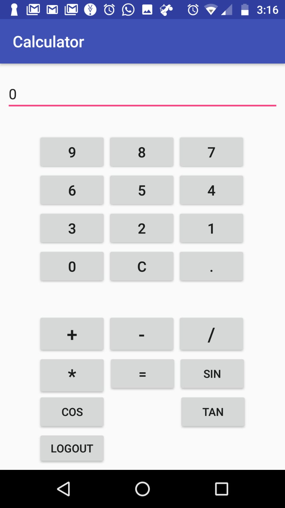

# AndroidCalculatorApp

This is an android app which is used for basic arithmetic functions.

## Functionnality

1. This app will ask for valid Google and Facebook account to log in. 
2. Once the user is logged in, the App will navigate to calculator.
3. User can perform arithmetic functions like addition, subtraction, finding sin value, etc.

## Technology

1. Andriod SDK(using Java)
2. FIrebase API for Google and Facebook login.

## Output

## Author
Gauri Govind Rajulu
